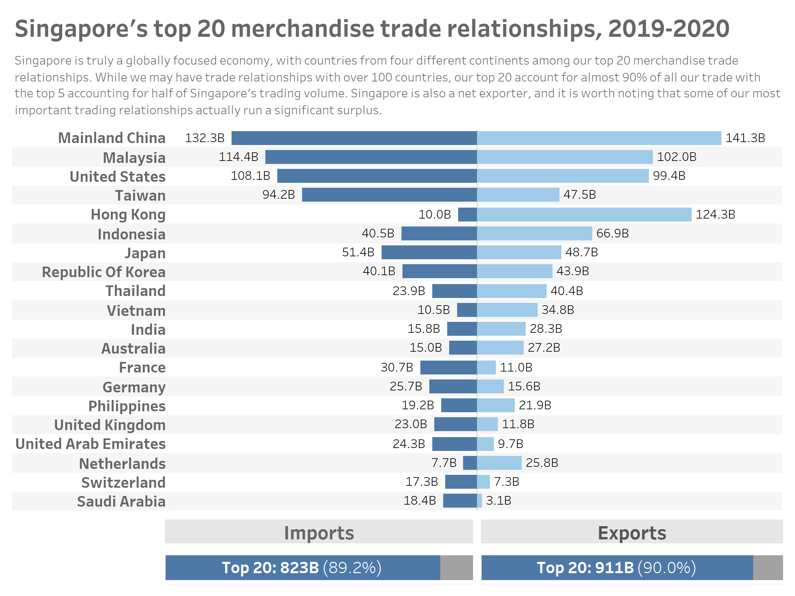

# 1. Critique of the visualisation

## 1.1 Clarity

The intent of the visualisation is to describe Singapore's top six trade relationships between 2019 and 2020. However, it is difficult to discern a clear narrative from the visualisation because:

* **The axes ranges are not standardised across each graph in the grid.** This makes it difficult to compare the trends and figures from each country with each other as each are on different scales.

* **On each grid, the primary (export) and secondary (import) axes ranges are not standardised.** This makes it difficult to compare the relative proportion of import to exports for each trading partner. This proportion informs the reader whether the Singapore has a trade deficit or surplus with the respective trading partner. This detail is one of the key statistics used in defining a trading relationship.

* **The time scales are not standardised across the different trading partners.** Japan only has data for 2020, while all the others show data from 2019 to 2021.

* **The time scales also do not match the title,** which says "Merchandise Trade of Top Six Trading Countries, 2019-2020" even though 5 of the 6 grids show data going all the way to 2021, and the remaining grid (Japan) only shows data from 2020.

* **It is not be meaningful to visualise the data as a time series** as the data shows little variation between 2019 and 2020, as would be expected as trade relationships rarely change significantly over a period of one to two years.

## 1.2 Aesthetics

Besides clarity the aesthetics of the visualisation could also be improved. Some observed weaknesses are:

* **Use of area graphs clutters the visualisation with unnecessary data ink.**  The fill is not meaningful as it does not help to highlight anything from the data. Simple line graphs could easily communicate the same message with less clutter.

* **Grid is too small making it difficult to make out details in the data.** Visualising the data individually for each country results in a very cramped grid which is difficult to read as each graph is too small.

* **Wasted white space below the color legend.** The space in the visualisation is not utilised well. With the main visualisation already cramped, the space under the legend could have been better utilised by data ink.

# 2. Proposed alternative visualisation

## 2.1 Proposed narrative

## 2.2 Sketch of alternative visualisation

# 3. Step-by-step guide on preparing data visualisation in Tableau

# 4. Three major observations

