# 1. Critique of the visualisation

<center>


</center>

## 1.1 Clarity

The intent of the visualisation is to describe some of Singapore's most important mechandise trade relationships. It shows which countries are net exporters to Singapore and which are net importers, and also informs the reader of the  

* **Color coding used for two dimensions - export vs import, and country/region.** This makes it confusing for the reader as there is too much color in the visualisation. In order to direct the readers attention appropriately, one visualisation detail (e.g. size, colour, axes) should be used for one data dimension only.

<center>

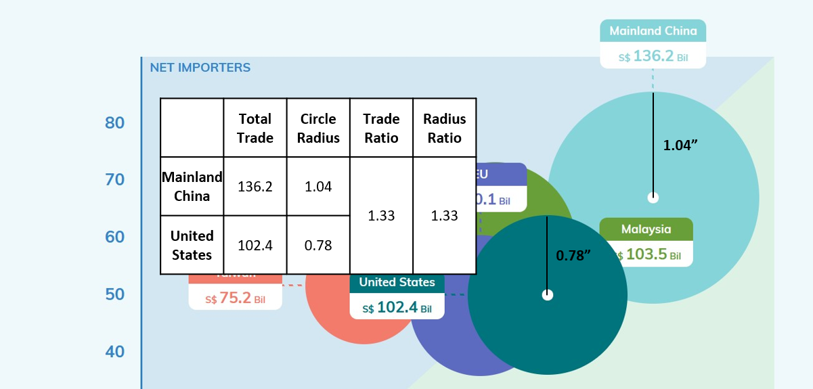

</center>

* **The scaling of the bubble size is not based on area (see Fig 2 above).** Instead, it is the radius which is proportional to the total bilateral trade volume. This makes the size scale polynomially (i.e. the square of the total bilateral trade volume)instead of linearly which can give rise to misinterpretation as the reader usually assumes that the size will scale linearly.

* **The bubbles are opaque, obscuring the data points showing the export/import amounts of some countries.** This makes it difficult to see exactly how much Singapore imports/exports to these countries. The data labels only quote the total bilateral merchandise trade volume, from which the reader cannot derive the import/export figures.

* **The axes labels at clustered around the origin rather than centred on the axes.** This makes it difficult for the reader to tell at a glance which axis refers to exports and which to imports. The visualisation attempts to use colours to differentiate the axes, but it is not as effective as using title positioning.

<center>


</center>


* **The graphic does not help to convey to the reader the key message annotated in the blue box (see Fig 3 above).** The key message in the blue box discusses Singapore's overall balance of trade with the two largest economies in the world, Mainland China and the United States. It references trade data going back to 2006. However, the data in the visualisation only shows data for 2020.

* **The annotation does note use similar time scales in comparing the two countries.** It compares trade with China dating back to 2009, but for the United States it uses trade data going back to 2006.

* **The visualisation designates a top net exporter and top net importer but does not explain what this means to the reader.** It appears from inspection that this refers to the country with which Singapore has the highest and lowest balance of trade.

## 1.2 Aesthetics

Besides clarity the aesthetics of the visualisation could also be improved. Some observed weaknesses are:

* **Use of large labels within opaque boxes creates a very cluttered impression.**  There is too much going on on the visualisation, with many boxes and icons scattered across the visualisation with very little explanatory value. For example, the data labels would be better served being inside the respective circles rather than sticking out from the circles to keep the rest of the graph clean.

<center>

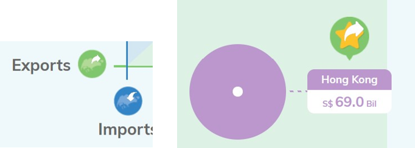

</center>

* **Unnecessary use of large icons clutters visualisation with non-data ink. ** The icons (e.g. 'Imports'/'Exports' and 'Top Importer'/'Top Exporter') are unnecessary. For the 'Imports'/'Exports' axes labels, the text would have been sufficient.

* **There is too much colour in the visualisation.** Even the background is blue even though color coding is a key detail used to convey information in this visualisation. The clash of colours is very irritating to the reader as it takes attention away from the key points the visualisation is trying to make.

# 2. Proposed alternative visualisation

The proposed visualisation will address the issues raised above.

* **An interactive side-by-side comparison of trade data from selected years will help readers to compare change in trade data over time.** This will help users to draw conclusions on any change in the nature of our trade relationships (e.g. change from net exporter to net importer or vice versa) as well as the relative importance of our various trade relationships when compared with one another.

* **Color coding on the bubble chart will only be used for countries.** This will help to direct the users attention appropriately to changes in our relationships with various countries/regions relative to each other.

* **Axes are labeled in the middle of the axis for clarity.**

* **Bubble size scales linearly, with the area corresponding to the relative volume of bilateral trade with respective country.**

* **Reduce opacity of bubble fills so that all data points can be clearly visible.**

* **Total Bilateral Trade is plotted separately as a supplementary chart.** This will allow the reader to quickly see how our trade relationships are ranked year to year and identify trends (e.g. are some countries/regions becoming more/less important over time).

* **Balance of trade is plotted separately as a supplementary chart.** This does away with the need to identify 'Top net exporter' or 'Top net importer' with icons as the balance of trade plot will show the relative ranking of the various countries over time. We can also see trends in our trade relationships over time (E.g. some relationships evolving from net exporter to net importer and vice versa).

* **Link all charts so that when a country is selected, it will be highlighted across all charts for attention.** This will allow the reader to zoom into the relevant country and make comparisons.

* **Custom tooltips to highlight key information more clearly.**

<center>


</center>

# 3. Step-by-step guide on preparing data visualisation in Tableau

## 3.1 Data preparation in Excel

As the dataset used is the same as Data Viz Makeover 1, we follow the same steps noted in [Data Viz Makeover 1](https://arnoldndx.netlify.app/posts/2021-05-22-my-1st-post/) to prepare the data.

## 3.2 Visualisation in Tableau

Once the data has been prepared, we now move to Tableau to execute the proposed visualisation.

Step | Actions Required | Screenshot
-----|------------------|-----------
1    | First, load the processed data into Tableau and join the _Import_ and _Export_ tables. We should use a **full outer join** as there will be cases where a country has registered exports but no registered imports for the given time period and vice versa. Any other form of join (e.g. left outer, right outer, inner) will result in loss of data. The data should be joined on _Country/Region_ and _Date_ | 
2    | Next, create calculated fields to consolidate the data for _Country/Region_ and _Date_ as these fields will be nil for some rows if we only look at _Imports_ or _Exports_. We can do this using an _IFNULL_ statement. | 
3    | Now create a calculated field for the total bilateral trade (i.e. exports + imports) and balance of trade (i.e. exports - imports). Be sure to use _IFNULL_ to convert nulls to zeroes as null + value will return a null. This will cause the later visualisation to be wrong as data will be missed.| 
4    | Now to begin creating the bubble charts. First, drag the import and export measures from the _Data_ pane on the left to row and column respectively. | 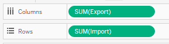
5    | Then, select 'circle' under _Marks_. To color code the chart by country/region, drag the _Country/Region_ dimension to the _Color_ button under _Marks_. Then click on the _Color_ button and set the opacity to ~50% and the border to white. To make the bubble size proportional to total bilateral trade volume, drag _Total Bilateral Trade_ calculated measure to _Size_ button under _Marks_. |  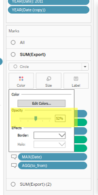
6    | We now want to filter the chart to only see the ten countries/regions identified in the original visualisation. Drag the _Country/Region_ and to the _Filters_ tab and select the ten countries/regions. | 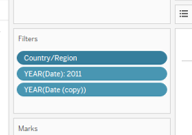 
7    | We want to create a toggle to allow the user to select the year for which we will display the data. However, we want to limit the user's options to just the years between 2011 to 2020. To do so, we will need to create a copy of the _Date_ dimension. Then drag the _Date (copy)_ dimension to the _Filters_ tab, select "Year" when prompted, and then select all the years between 2011 and 2020. Then drag _Date_ to the _Filters_ tab, select "Year" when prompted, and then select "2011". Once the filter has been established, right-click the filter and select "Show Filter". You should see the filter selector appear on the right. | 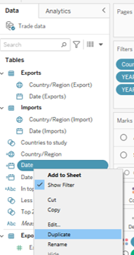  
8    | Adjust the filter toggle's settings to get the desired output. Click the top-right corner of the filter toggle and select "Single Value (list)" option and the "Only Relevant Values" option. Then navigate to "Customise" and uncheck the "Show 'All' Value" option. | 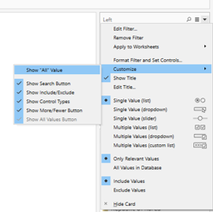
9    | Now we want to create the centroid of each bubble to that users can easily compare the respective import/export positions of the different countries. To do this we will use Dual Axes to plot the same Export vs Import data on top of the bubble chart. Drag the _Export_ measure to the top edge of the chart till you see a dotted line appear. Do the same with the _Import_ measure on the right edge of the chart. | 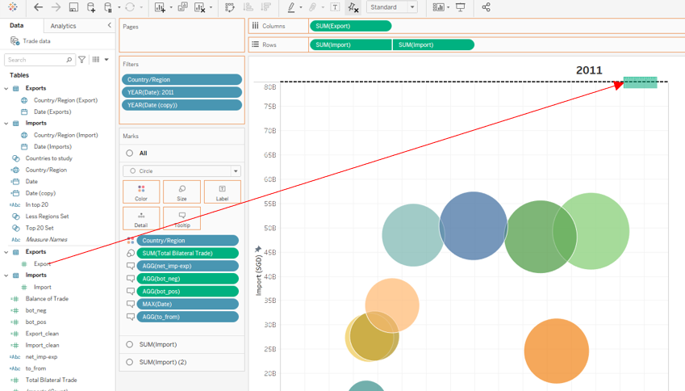
10   | Select 'Circle' as the mark type, and select white as the color. Adjust the size of the centroid by clicking the _Size_ button on the _Marks_ tab and making the adjustment using the slider. We will also use this mark to label the bubbles, so drag _Country/Region_ and _Total Bilateral Trade_ to the _Label_ button in the _Marks_ tab. Change the number format of _Total Bilateral Trade_ so that it displays in billions and one decimal place. Remove the secondary axes by right-clicking and unchecking "Show Header". |  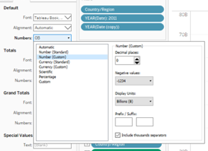 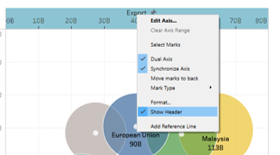
11   | We now want to standardise the axes to ensure that the left and right bubble charts are always directly comparable. Right-click the _Import_ axis and select "Edit Axis". Set the _Range_ to "Fixed" and fix the range between 0 and 80B. Also edit the axis title to include the units. Repeat with the _Export_ axis. | 
12   | We want each bubble chart to be labelled with the selected year so that users can see which two years they are comparing. To do this, double click the sheet title on the top of the sheet and change the text to a variable, "<Year(Date)>. The title of the bubble chart will now display the selected year. | 
13   | In order to give the user an idea of how the relationship changes over time, we will introduce animations that will kick in whenever the user toggles the year for the bubble chart. The movement will highlight to the user the relative changes in the trade relationship of respective countries. Select _Format_ from the ribbon and click on _Animations_. Then on the _Animations_ pane, select "On" and set the duration to "Medium". | 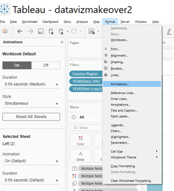
14   | Now we will create the custom tooltip so that the user can get an informative analysis when he mouses over the respective bubble. 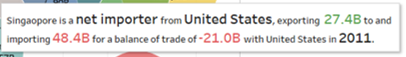 To create the reactive color coding and "+/-" prefix for the balance of trade, we will need to create two calculated fields, one field, _bot_neg_ will be null when the balance of trade is positive, and the other field, _bot_pos_ will be null when the balance of trade is negative. Use an IF statement to do this. Next, we also want to have reactive text highlighting whether Singapore is a net importer from or exporter to the respective country. We do this similarly with IF statement to create two more calculated variables, _net_imp-exp_ and _to_from_. We separate out the "to/from" so that we can highlight the "net importer"/"net exporter" with an increased font size. Once done, drag all the new calculated fields into the _Tooltip_ button on the _Marks_ tab. Now drag the _Date_ into the _Tooltip_ button as well. _Date_ is trickier because there are multiple dates to be aggregated as the date in the data is given by month. To resolve this issue, we select "Maximum" under _Measure_ and adjust the format of the date to show only the year. Finally put it all together by clicking the _Tooltip_ button and typing the text out as shown. |  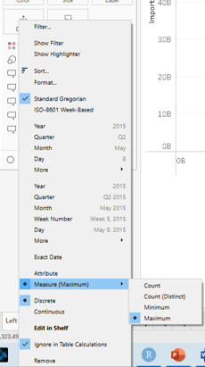 
15   | Hurray! You are now done with the bubble chart. Name this sheet "Left" and duplicate the sheet by right-clicking the sheet tab at the bottom and clicking duplicate. | 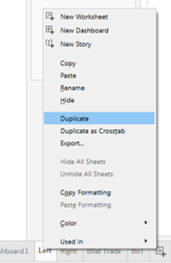


And now you're done!

# 4. New Visualisation and Observations

Executing the visualisation described in Section 2, we produce the following graphic. The workbook can also be accessed on Tableau Public [here](https://public.tableau.com/app/profile/arnold.ng6549/viz/datavizmakeover2_16242002706520/Dashboard1).

<center>

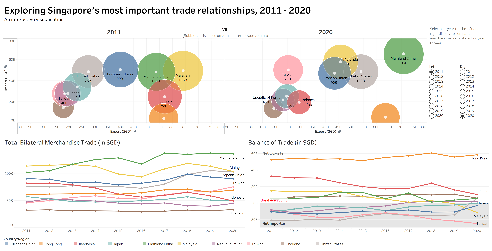

</center>

**Embedded Interactive Visualisation**

```{r, echo=FALSE}
htmltools::includeHTML("embed.html")
```

From the visualisation, we can make the following observations:

* **Since 2011, our trade with China and the United States has grown most strongly, with China surpassing Malaysia as our main trading partner in 2013.** The increase in merchandise trade volume with the United States has been driven by strong export growth, which has caused the relationship to evolve from a net importer to net exporter in 2020. With China, growth is more even between both imports and exports and our balance of trade has been largely hovering between +1.0B to +13.0B.

* **Our trading relationship with Malaysia has been steadily changing over time, from a net exporter with +14.9B balance of trade in 2011 to a net importer with -11.6B balance of trade in 2020.** This could be due to a shift in our economy to focus more on high-tech manufacturing and services which have less demand in Malaysia, while we continue to purchase large quantities of food and other commodities from Malaysia.

* **Our well diversified portfolio of trading relationships allows us to maintain a health balance of trade.** Even though relationships with individual countries have been changing significantly over time due to trends in the global economy as well as Singapore's efforts to transform our economy to remain relevant in the future, we are still able to maintain a healthy current account balance as we balance lost export revenue from some countries with increased export revenue to other countries.

