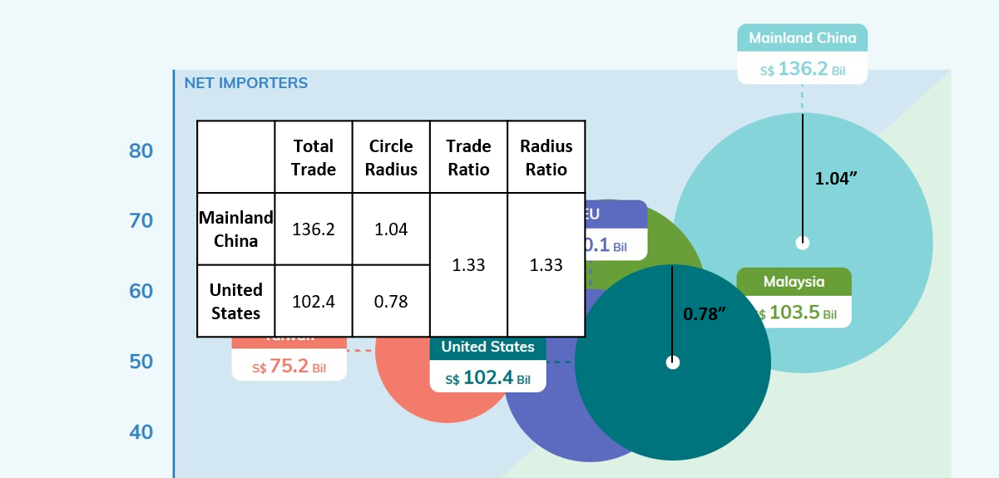

# 1. Critique of the visualisation

<center>


</center>

## 1.1 Clarity

The intent of the visualisation is to describe some of Singapore's most important mechandise trade relationships. It shows which countries are net exporters to Singapore and which are net importers, and also informs the reader of the  

* **Color coding used for two dimensions - export vs import, and country/region.** This makes it confusing for the reader as there is too much color in the visualisation. In order to direct the readers attention appropriately, one visualisation detail (e.g. size, colour, axes) should be used for one data dimension only.

<center>



</center>

* **The scaling of the bubble size is not based on area (see Fig 2 above).** Instead, it is the radius which is proportional to the total bilateral trade volume. This makes the size scale polynomially (i.e. the square of the total bilateral trade volume)instead of linearly which can give rise to misinterpretation as the reader usually assumes that the size will scale linearly.

* **The bubbles are opaque, obscuring the data points showing the export/import amounts of some countries.** This makes it difficult to see exactly how much Singapore imports/exports to these countries. The data labels only quote the total bilateral merchandise trade volume, from which the reader cannot derive the import/export figures.

* **The axes labels at clustered around the origin rather than centred on the axes.** This makes it difficult for the reader to tell at a glance which axis refers to exports and which to imports. The visualisation attempts to use colours to differentiate the axes, but it is not as effective as using title positioning.

<center>


</center>


* **The graphic does not help to convey to the reader the key message annotated in the blue box (see Fig 3 above).** The key message in the blue box discusses Singapore's overall balance of trade with the two largest economies in the world, Mainland China and the United States. It references trade data going back to 2006. However, the data in the visualisation only shows data for 2020.

* **The annotation does note use similar time scales in comparing the two countries.** It compares trade with China dating back to 2009, but for the United States it uses trade data going back to 2006.

* **The visualisation designates a top net exporter and top net importer but does not explain what this means to the reader.** It appears from inspection that this refers to the country with which Singapore has the highest and lowest balance of trade.

## 1.2 Aesthetics

Besides clarity the aesthetics of the visualisation could also be improved. Some observed weaknesses are:

* **Use of large labels within opaque boxes creates a very cluttered impression.**  There is too much going on on the visualisation, with many boxes and icons scattered across the visualisation with very little explanatory value. For example, the data labels would be better served being inside the respective circles rather than sticking out from the circles to keep the rest of the graph clean.

<center>


</center>

* **Unnecessary use of large icons clutters visualisation with non-data ink. ** The icons (e.g. 'Imports'/'Exports' and 'Top Importer'/'Top Exporter') are unnecessary. For the 'Imports'/'Exports' axes labels, the text would have been sufficient.

* **There is too much colour in the visualisation.** Even the background is blue even though color coding is a key detail used to convey information in this visualisation. The clash of colours is very irritating to the reader as it takes attention away from the key points the visualisation is trying to make.

# 2. Proposed alternative visualisation

The proposed visualisation will address the issues raised above.

* **An interactive side-by-side comparison of trade data from selected years will help readers to compare change in trade data over time.** This will help users to draw conclusions on any change in the nature of our trade relationships (e.g. change from net exporter to net importer or vice versa) as well as the relative importance of our various trade relationships when compared with one another.

* **Color coding on the bubble chart will only be used for countries.** This will help to direct the users attention appropriately to changes in our relationships with various countries/regions relative to each other.

* **Axes are labeled in the middle of the axis for clarity.**

* **Total Bilateral Trade is plotted separately as a supplementary chart.** This will allow the reader to quickly see how our trade relationships are ranked year to year and identify trends (e.g. are some countries/regions becoming more/less important over time).

* **Balance of trade is plotted separately as a supplementary chart.** This does away with the need to identify 'Top net exporter' or 'Top net importer' with icons as the balance of trade plot will show the relative ranking of the various countries over time. We can also see trends in our trade relationships over time (E.g. some relationships evolving from net exporter to net importer and vice versa).

* **Reduce opacity of bubble fills so that all data points can be clearly visible.**

* **Link all charts so that when a country is selected, it will be highlighted across all charts for attention.** This will allow the reader to zoom into the relevant country and make comparisons.

* **Custom tooltips to highlight key information more clearly.**

<center>


</center>

# 3. Step-by-step guide on preparing data visualisation in Tableau

## 3.1 Data preparation in Excel

As the dataset used is the same as Data Viz Makeover 1, we follow the same steps noted in [Data Viz Makeover 1](https://arnoldndx.netlify.app/posts/2021-05-22-my-1st-post/) to prepare the data.

## 3.2 Visualisation in Tableau

Once the data has been prepared, we now move to Tableau to execute the proposed visualisation.

Step | Actions Required | Screenshot
-----|------------------|-----------
1    | First, load the processed data into Tableau and join the _Import_ and _Export_ tables. We should use a **full outer join** as there will be cases where a country has registered exports but no registered imports for the given time period and vice versa. Any other form of join (e.g. left outer, right outer, inner) will result in loss of data. The data should be joined on _Country/Region_ and _Date_ | 
2    | Next, create calculated fields to consolidate the data for _Country/Region_ and _Date_ as these fields will be nil for some rows if we only look at _Imports_ or _Exports_. We can do this using an _IFNULL_ statement. | 
3    | Now create a calculated field for the total bilateral trade (i.e. exports + imports). We will be using this value to rank the countries/regions later. Be sure to use _IFNULL_ to convert nulls to zeroes as null + value will return a null. This will cause the later visualisation to be wrong as data will be missed.| 
4    | **Create the bubble charts.** First, 

And now you're done!

# 4. New Visualisation and Observations

Executing the visualisation described in Section 2, we produce the following graphic. The workbook can also be accessed on Tableau Public [here](https://public.tableau.com/app/profile/arnold.ng6549/viz/datavizmakeover2_16242002706520/Dashboard1).

<center>


</center>

**Embedded Interactive Visualisation**

```{r, echo=FALSE}
htmltools::includeHTML("embed.html")
```

From the visualisation, we can make the following observations:

* **Since 2011, our trade with China and the United States has grown most strongly, with China surpassing Malaysia as our main trading partner in 2013.** The increase in mechandise trade volume with the United States has been driven by strong export growth, which has caused the relationship to evolve from a net importer to net exporter in 2020. With China, growth is more even between both imports and exports and our balance of trade has been largely hovering between +1.0B to +13.0B.

* **Our trading relationship with Malaysia has been steadily changing over time, from a net exporter with +14.9B balance of trade in 2011 to a net importer with -11.6B balance of trade in 2020.** This could be due to a shift in our economy to focus more on high-tech manufacturing and services which have less demand in Malaysia, while we continue to purchase large quantities of food and other commodities from Malaysia.

* **Our well diversified portfolio of trading relationships allows us to maintain a health balance of trade.** Even though relationships with individual countries have been changing significantly over time due to trends in the global economy as well as Singapore's efforts to transform our economy to remain relevant in the future, we are still able to maintain a healthy current account balance as we balance lost export revenue from some countries with increased export revenue to other countries.

