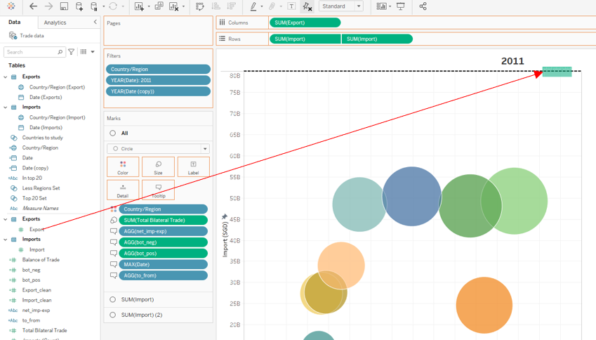
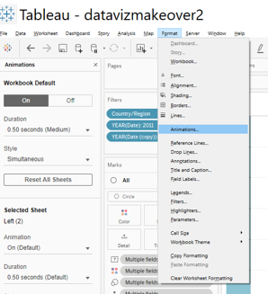
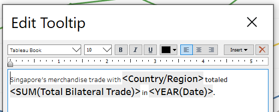

# 1. Critique of the visualisation

## 1.1 Clarity

The intent of the visualisation is to describe Singapore's top six merchandise trade relationships between 2019 and 2020. However, it is difficult to discern a clear narrative from the visualisation because:

* **The axes ranges are not standardised across each graph in the grid.** This makes it difficult to compare the trends and figures from each country with each other as each are on different scales.

* **On each grid, the primary (export) and secondary (import) axes ranges are not standardised.** This makes it difficult to compare the relative proportion of import to exports for each trading partner. This proportion informs the reader whether the Singapore has a trade deficit or surplus with the respective trading partner. This detail is one of the key statistics used in defining a trading relationship.

* **The time scales are not standardised across the different trading partners.** Japan only has data for 2020, while all the others show data from 2019 to 2021.

* **The time scales also do not match the title,** which says "Merchandise Trade of Top Six Trading Countries, 2019-2020" even though 5 of the 6 grids show data going all the way to 2021, and the remaining grid (Japan) only shows data from 2020.

* **It is not be meaningful to visualise the data as a time series** as the data shows little variation between 2019 and 2020, as would be expected as trade relationships rarely change significantly over a period of one to two years.

## 1.2 Aesthetics

Besides clarity the aesthetics of the visualisation could also be improved. Some observed weaknesses are:

* **Use of area graphs clutters the visualisation with unnecessary data ink.**  The fill is not meaningful as it does not help to highlight anything from the data. Simple line graphs could easily communicate the same message with less clutter.

* **Use of individual axes for each graph clutters the visualisation with alot of non-data ink. ** Standardising the axes would not only fix clarity issues (mentioned in Section 1.1), but also allow the removal of the axes from some of the grids to reduce non-data ink which distracts from the actual visualisation.

* **Grid is too small making it difficult to make out details in the data.** Visualising the data individually for each country results in a very cramped grid which is difficult to read as each graph is too small.

* **Wasted white space below the color legend.** The space in the visualisation is not utilised well. With the main visualisation already cramped, the space under the legend could have been better utilised by data ink.

# 2. Proposed alternative visualisation

## 2.1 Proposed narrative

The visualisation should inform the reader about Singapore's merchandise trade based on the trading volume data. The user should be able to draw some key insights such as:

* Who are Singapore's biggest trading partners?

* Is Singapore too dependent on a handful of countries?

* Does Singapore import more than we export?

This narrative will help to give the reader an idea of Singapore's merchandise trade dependecies.

## 2.2 Sketch of alternative visualisation

Based on the above narrative, it is proposed that the data be visualised as a "pyramid" chart, where:

* **Export and Import volumes are visualised side by side on inverted axes.** This will allow a reader to immediately see the total bilateral trade volume for a given country/region. It also informs the reader of the nature of the trading relationship with that country/region (e.g. surplus or deficit).

* **The data is sorted in descending order of total bilateral trade volume.** This will allow the reader to immediately see which are our most important trading partners.

* **Data should be truncated to the top _N_ trading relationships so that the visualisation does not get too cluttered.** _N_ should be a nice round number (e.g. 10, 20) to make for easy reading.

* **Axes should be removed to reduce non-data ink.** They are unnecessary anyway, as the relative differences in the trading volumes are well captured by the length of the bars. We can also add data labels for easy reading.

* **Imports are put on the left as people tend to associate the rightward direction with outgoing and the leftward direction with incoming.** This helps to make the visualisation more intuitive.

* **Use the same colors, but different shades, for imports and exports.** This helps to reduce the number of different colours on the page and helps the reader to focus on the length of the bars which is the main focus of the visualisation.

* **Additional visualisation at the bottom shows how big a share of our merchandise trading volumes is dependent on the top _N_ countries.** This will help to give the reader a sense of our dependence on these relationships.

# 3. Step-by-step guide on preparing data visualisation in Tableau

## 3.1 Data preparation in Excel

In order to use the data in Tableau to generate the desired visualisation, we would first have to "unstack" the table and ensure that the date is stored as a dimension, rather than be used as a column name. This will allow Tableau to process the data as a time series.

This data transformation can be done using Excel VBA. Be sure to pay attention to the data, as there might be some inconsistency that will impact the transformation. For example, "na" is usually used to denote missing data. However, from Jan 1998 to Dec 1998, trade data for imports from 'Yemen Democratic' was indicated by '-'. The macro below includes code breaks to help pick out such issues. In this case, simple replace all '-' with 'na'.

You may refer [here](https://docs.microsoft.com/en-us/office/vba/library-reference/concepts/getting-started-with-vba-in-office) for details on how to use VBA on Microsoft Excel. The site will show you how to access the script editor. I've also provided the script I used to process the data below. This script can be copied into the script editor and run to transform the data into the desired form.

**Example VBA script to perform data transformation:**

::: {.sourceCode}

    #VBA code to execute data processing

    Sub unstack_table()

    Dim data_range As Range
    Dim data As String

    If ActiveSheet.Name = "T1" Then
        data = "Imports"
    ElseIf ActiveSheet.Name = "T2" Then
        data = "Exports"
    Else
        GoTo err_break1
    End If
    
    Set data_range = Range("B8", Range("B8").End(xlDown).End(xlToRight))

    For i = 1 To data_range.Rows.Count
        For j = 1 To data_range.Columns.Count
            If data_range.Cells(i, j) <> "na" Then
                Sheets(data).Cells(1, 1).End(xlDown).Offset(1).Value = _
                  Trim(Split(data_range.Cells(i, 1).Offset(, -1).Text, "(")(0))
                Sheets(data).Cells(1, 2).End(xlDown).Offset(1).Value = _
                  Split(data_range.Cells(1, j).Offset(-2).Text, " ")(1) & " " & _
                  Split(data_range.Cells(1, j).Offset(-2).Text, " ")(0)
                If Split(data_range.Cells(i, 1).Offset(, -1).Text, "(")(1) = _
                  "Thousand Dollars)" Then
                    Sheets(data).Cells(1, 3).End(xlDown).Offset(1).Value = _
                      data_range.Cells(i, j).Value * 1000
                ElseIf Split(data_range.Cells(i, 1).Offset(, -1).Text, "(")(1) = _
                  "Million Dollars)" Then
                    Sheets(data).Cells(1, 3).End(xlDown).Offset(1).Value = _
                    data_range.Cells(i, j).Value * 1000000
                Else
                    GoTo err_break2
                End If
            End If
        Next j
    Next i

    GoTo endsub

    err_break1:

    MsgBox "Select either sheet T1 or T2 to run the macro"

    GoTo endsub

    err_break2:

    MsgBox "Something is wrong with " & data_range.Cells(i, 1).Offset(, -1).Text

    endsub:

    End Sub
:::

Perform this transformation on both the _Import_ and _Export_ data to generate two separate tables. Note that in the event of 'na', the data is not copied over, which will result in 'null' returns when the data is visualised in Tableau. This should be the correct interpretation for the missing data at this point, as we cannot assume that missing data means that there was no trade at all (which is indicated by a zero in the data). 

## 3.2 Visualisation in Tableau

Once the data has been prepared, we now move to Tableau to execute the proposed visualisation.

Step | Actions Required | Screenshot
-----|------------------|-----------
1    | First, load the processed data into Tableau and join the _Import_ and _Export_ tables. We should use a **full outer join** as there will be cases where a country has registered exports but no registered imports for the given time period and vice versa. Any other form of join (e.g. left outer, right outer, inner) will result in loss of data. The data should be joined on _Country/Region_ and _Date_ | 
2    | Next, create calculated fields to consolidate the data for _Country/Region_ and _Date_ as these fields will be nil for some rows if we only look at _Imports_ or _Exports_. We can do this using an _IFNULL_ statement. | 
3    | Now create a calculated field for the total bilateral trade (i.e. exports + imports). We will be using this value to rank the countries/regions later. Be sure to use _IFNULL_ to convert nulls to zeroes as null + value will return a null. This will cause the later visualisation to be wrong as data will be missed.| 
4    | Create the centrepiece of the data visualisation, the 'pyramid' bar chart. We do this by dragging _Imports_ and _Exports_ into the columns and setting the visualisation to bar. Change the color of the _Exports_ bars to differentiate them from the _Imports_ bars by selecting _Color_ on the _Marks_ tab and editing the color for the _Exports_ bar graph. Then we drag _Country/Region_ into the rows so that the data is split by country/region. To achieve row banding for better visualisation, right-click _Country/Region_ and select _Format_. Then select the _Shading_ tab (i.e. the third tab) and choose a colour for _Pane_ under _Row Banding_. Set the _Banding Size_ to the second notch. Finally, we use the filters to filter the data by date to 2019-2020 which is the time range specified in the original visualisation. | 
5    | Right-click the horizontal axis of _Imports_, which should be on the left side of the graph and reverse the axis so that the origin starts from the right instead of the left. This will create the "pyramid" look | 
6    | While on the edit axis menu, select _Tick Marks_ and set both major and minor tick marks to _None_. We don't want to clutter out visualisation with non-data ink! Repeat this with the _Export_ axis and then hide both axes by right-clicking and deselecting the _Show Header_ option. | 
7    | Add data labels by dragging _Imports_ and _Exports_ to the respective _Marks_ tab. Format the number by clicking on the right side of the green pill bar and selecting _Format_. Then select _Pane_ and edit the number format in _Number_. We want to visualise the number in 'billions' to reduce the length of the numbers and reduce clutter in our visualisation. | 
8    | Right-click the _Country/Region_ headers on the left and click _Format_. Then adjust the fonts and size in the _Header_ tab. | 
9    | Now right-click the _Country/Region_ pill bar under _Rows_ and select _Sort_. We will now sort the data in the bar graphs by total bilateral trade volumes to identify our most important merchandise trade relationships. | 
10   | Notice that interspersed among our biggest trade relationships are regions which are actually whole continents (e.g. Asia, America). These are aggregated data from the countries that belong in the respective continent or region (e.g. European Union). We will have to remove this data from the visualisation to avoid double counting. Drag the _Country/Region_ dimension into the _Filters_ tab and then right-click and _Edit Filter_. Uncheck the continents and regions. | 
11   | Now we can see all out trading relationships between 2019-2020. We shall pick the top 20 relationships for the visualisation. Right-click the _Country/Region_ filter and select the _Top_ tab. Then select _By field_ and specify the top 20 in _Total Bilateral Trade_. You are now done with the centrepiece graph!| 
12   | To create the bars showing the proportion of total trading volume contributed by the top 20 countries/regions, we will need to do so on a new worksheet. Create a new sheet by selecting the _New Worksheet_ button at the the bottom. | 
13   | Drag _Imports_ to columns and select _Bar_ as the type of mark. Perform the necessary filtering as described in Steps 4 and 10. In order to reuse this for the _Exports_ chart, right-click the _Country/Regions_ filter and click _Create Set_. You can call this set "Less Regions Set" | 
14   | Create a another set by right-clicking _Country/Region_ under the _Data_ tab on the left of the screen. Then select _Create_ and _Set_. In this set, select the top 20 countries as identified from the visualisation generated in Steps 1 to 11. | 
15   | Now drag this new set into the _Marks_ tab and set it to color. Then click the _Color_ button on the _Marks_ tab and click _Edit Colors..._. Choose the colors for the _IN_ and _OUT_. This specifies the colors for data within the top 20 countries set and outside the top 20 countries set. We will make them blue and gray for maximum contrast as shade is already used to distinguish between exports and imports. | 
16   | We will need the data labels to be informative as we want to reduce clutter and non-data ink. Therefore, we will need to create a calculated field that will label the top 20 countries data with "Top 20:" and not label anything on the data outside the set. | 
17   | Then use _Quick Table Calculation_ to create the _Percent of Total_ to add to the data label. | 
18   | Put it all together by using the _Edit Label_ function in the _Marks_ tab as shown. | 
19   | Repeat this for _Exports_.
20   | Finally, it is time to put everything together into our final visualisation. We will use a dashboard to do this, so create a dashboard by clicking the respective button at the bottom. | 
21   | Drag the sheets onto the page and arrange them in a neat order. Use the _Blank_ objects for spacers as needed and the _Text_ objects to input text into your visualisations. | 
22   | Use the _Layout_ tab to provide background color for your text objects as needed. | 

And now you're done!

# 4. New Visualisation and Observations

Executing the visualisation described in Section 2, we produce the following graphic. The workbook can also be accessed on Tableau Public [here](https://public.tableau.com/app/profile/arnold.ng6549/viz/datavizmakeover1/Dashboard1).

From the visualisation, we can make the following observations:

* **It becomes immediately apparent that the original visualisation was incorrect in identifying Singapore's top 6 merchandise trade relationships.** It should be Indonesia and not Japan which is included in the top 6.

* **We have a diverse and global set of trading partners,** with four continents represented amongst our top 20 merchandise trading relationships.

* **Our top 5 trade relationships account for nearly half of our merchandise trade by volume, and our top 20 account for about 90% of our merchandise trade.** This shows that while we are fairly well diversified geographically speaking, Singapore is still quite dependent on a handful of major trading partners.

* **We are a net exporter.** We export about 10% more merchandise (by value) than we import, which indicates that we run a trade surplus with regards to merchandise. Some of our trade relationships feature a significant trade imbalance (e.g. trade with Hong kong runs a signficant surplus, while trade with Taiwan runs a significant deficit). This information, along with information types of merchandise exported, services trade data, etc. are important to inform our exchange rate policy, which has significant impacts on our trade.

